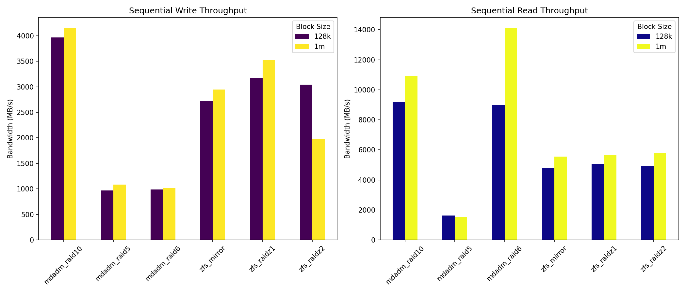

# mdadm vs ZFS 性能比較報告

生成日期: 2026-01-16 14:19

## 1. スループット評価

### 循序讀寫效能 (MB/s)

| test_name    | rw_type   | file_size   | block_size   |   bandwidth_MBps |      iops |
|:-------------|:----------|:------------|:-------------|-----------------:|----------:|
| mdadm_raid10 | read      | 10G         | 128k         |          8483.58 | 67868.1   |
| mdadm_raid10 | read      | 10G         | 1m           |         12164.3  | 12163.8   |
| mdadm_raid10 | read      | 1G          | 128k         |          7533.88 | 60270.6   |
| mdadm_raid10 | read      | 1G          | 1m           |         11022.2  | 11021.7   |
| mdadm_raid10 | read      | 5G          | 128k         |         11481.6  | 91852.2   |
| mdadm_raid10 | read      | 5G          | 1m           |          9511.5  |  9510.97  |
| mdadm_raid10 | write     | 10G         | 128k         |          4005.31 | 32042     |
| mdadm_raid10 | write     | 10G         | 1m           |          5621.92 |  5621.39  |
| mdadm_raid10 | write     | 1G          | 128k         |          3910.72 | 31285.3   |
| mdadm_raid10 | write     | 1G          | 1m           |          5257.06 |  5256.53  |
| mdadm_raid10 | write     | 5G          | 128k         |          3988.33 | 31906.2   |
| mdadm_raid10 | write     | 5G          | 1m           |          1563.19 |  1562.67  |
| mdadm_raid5  | read      | 10G         | 128k         |          1773.07 | 14184     |
| mdadm_raid5  | read      | 10G         | 1m           |          1622.42 |  1621.89  |
| mdadm_raid5  | read      | 1G          | 128k         |          1477.93 | 11822.9   |
| mdadm_raid5  | read      | 1G          | 1m           |          1443.04 |  1442.51  |
| mdadm_raid5  | read      | 5G          | 128k         |          1660.6  | 13284.3   |
| mdadm_raid5  | read      | 5G          | 1m           |          1511.62 |  1511.09  |
| mdadm_raid5  | write     | 10G         | 128k         |          1047.09 |  8376.19  |
| mdadm_raid5  | write     | 10G         | 1m           |          1085.08 |  1084.55  |
| mdadm_raid5  | write     | 1G          | 128k         |           927.85 |  7422.27  |
| mdadm_raid5  | write     | 1G          | 1m           |          1101.62 |  1101.09  |
| mdadm_raid5  | write     | 5G          | 128k         |           940.27 |  7521.68  |
| mdadm_raid5  | write     | 5G          | 1m           |          1059.8  |  1059.28  |
| mdadm_raid6  | read      | 10G         | 128k         |          9080.61 | 72644.4   |
| mdadm_raid6  | read      | 10G         | 1m           |         14769    | 14768.5   |
| mdadm_raid6  | read      | 1G          | 128k         |          7921.59 | 63372.3   |
| mdadm_raid6  | read      | 1G          | 1m           |         11472.8  | 11472.2   |
| mdadm_raid6  | read      | 5G          | 128k         |          9984.15 | 79872.7   |
| mdadm_raid6  | read      | 5G          | 1m           |         16066.5  | 16065.9   |
| mdadm_raid6  | write     | 10G         | 128k         |           818.45 |  6547.12  |
| mdadm_raid6  | write     | 10G         | 1m           |           796.34 |   795.807 |
| mdadm_raid6  | write     | 1G          | 128k         |          1044.29 |  8353.82  |
| mdadm_raid6  | write     | 1G          | 1m           |          1083.1  |  1082.58  |
| mdadm_raid6  | write     | 5G          | 128k         |          1104.83 |  8838.14  |
| mdadm_raid6  | write     | 5G          | 1m           |          1174.25 |  1173.72  |
| zfs_mirror   | read      | 10G         | 128k         |          4539.98 | 36319.3   |
| zfs_mirror   | read      | 10G         | 1m           |          4664.62 |  4664.09  |
| zfs_mirror   | read      | 1G          | 128k         |          5181.17 | 41448.9   |
| zfs_mirror   | read      | 1G          | 1m           |          7203.81 |  7203.28  |
| zfs_mirror   | read      | 5G          | 128k         |          4677.25 | 37417.5   |
| zfs_mirror   | read      | 5G          | 1m           |          4806.6  |  4806.07  |
| zfs_mirror   | write     | 10G         | 128k         |          1520.02 | 12159.7   |
| zfs_mirror   | write     | 10G         | 1m           |          1592.39 |  1591.86  |
| zfs_mirror   | write     | 1G          | 128k         |          5082.9  | 40662.7   |
| zfs_mirror   | write     | 1G          | 1m           |          5727.27 |  5726.74  |
| zfs_mirror   | write     | 5G          | 128k         |          1551.03 | 12407.8   |
| zfs_mirror   | write     | 5G          | 1m           |          1516.47 |  1515.94  |
| zfs_raidz1   | read      | 10G         | 128k         |          4511.07 | 36088.1   |
| zfs_raidz1   | read      | 10G         | 1m           |          5318.24 |  5317.71  |
| zfs_raidz1   | read      | 1G          | 128k         |          6066.06 | 48528     |
| zfs_raidz1   | read      | 1G          | 1m           |          6185.41 |  6184.9   |
| zfs_raidz1   | read      | 5G          | 128k         |          4668.48 | 37347.3   |
| zfs_raidz1   | read      | 5G          | 1m           |          5482.25 |  5481.73  |
| zfs_raidz1   | write     | 10G         | 128k         |          3319.12 | 26552.4   |
| zfs_raidz1   | write     | 10G         | 1m           |          3534.99 |  3534.46  |
| zfs_raidz1   | write     | 1G          | 128k         |          3119.71 | 24957.2   |
| zfs_raidz1   | write     | 1G          | 1m           |          3439.07 |  3438.54  |
| zfs_raidz1   | write     | 5G          | 128k         |          3084.83 | 24678.2   |
| zfs_raidz1   | write     | 5G          | 1m           |          3600.45 |  3599.92  |
| zfs_raidz2   | read      | 10G         | 128k         |          4468.21 | 35745.2   |
| zfs_raidz2   | read      | 10G         | 1m           |          5356.39 |  5355.86  |
| zfs_raidz2   | read      | 1G          | 128k         |          5823.78 | 46589.8   |
| zfs_raidz2   | read      | 1G          | 1m           |          6804.51 |  6803.99  |
| zfs_raidz2   | read      | 5G          | 128k         |          4470.22 | 35761.3   |
| zfs_raidz2   | read      | 5G          | 1m           |          5117.63 |  5117.1   |
| zfs_raidz2   | write     | 10G         | 128k         |          2249.59 | 17996.2   |
| zfs_raidz2   | write     | 10G         | 1m           |           951.81 |   951.284 |
| zfs_raidz2   | write     | 1G          | 128k         |          4610.13 | 36880.6   |
| zfs_raidz2   | write     | 1G          | 1m           |          3825.85 |  3825.32  |
| zfs_raidz2   | write     | 5G          | 128k         |          2265.01 | 18119.6   |
| zfs_raidz2   | write     | 5G          | 1m           |          1181.31 |  1180.78  |

## 2. レイテンシ評価

## 3. 同期書き込み評価

## 4. キャッシュ効果

## 5. 圧縮・チェックサム

## 6. 結論與建議

### mdadm 適用場景
- Linux 原生支援需求
- 記憶體受限環境
- 需要 RAID reshape 功能
- 簡單 RAID 需求

### ZFS 適用場景
- 資料完整性重要（研究/HPC）
- 需要快照/clone 功能
- 有充足記憶體（1GB/TB）
- 需要內建壓縮

### 效能總結
| 指標 | mdadm | ZFS | 備註 |
|------|-------|-----|------|
| 循序讀 | ★★★★☆ | ★★★★☆ | 相近 |
| 循序寫 | ★★★★★ | ★★★★☆ | mdadm 略快 |
| 隨機讀 | ★★★☆☆ | ★★★★☆ | ZFS ARC 優勢 |
| 隨機寫 | ★★★★☆ | ★★★☆☆ | mdadm 略快 |
| 同步寫 | ★★☆☆☆ | ★★★★☆ | ZFS+SLOG 優勢 |
